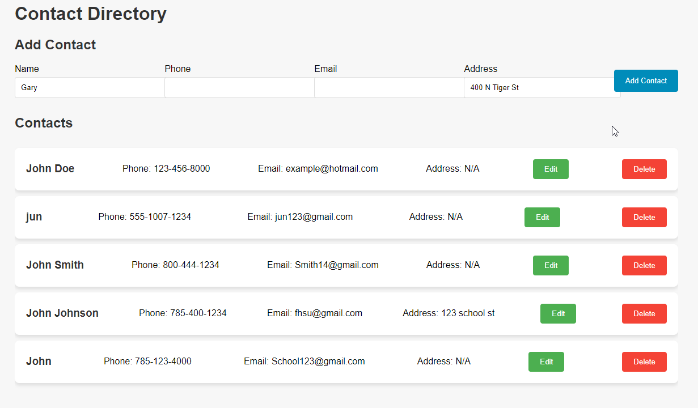
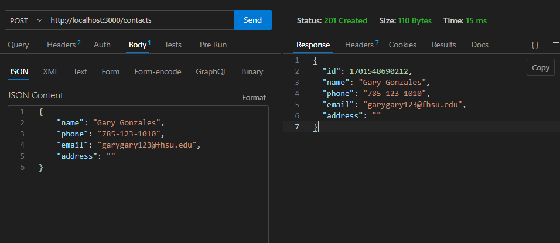

# INF656-Assignment 3 - Contact Directory

This project is a web application utilizing Express.js to manage a contact directory. The application will allow users to add, view, update, or delete contact information. All the contact information/data is stored in a local JSON file which will act as a database.

## Features

- Contact Mangement: Add, view, update, and delete contact information
- Data Validation with Middleware function
- Local JSON Storage
- Simple Interactive UI

## Prerequisites / Built With

- Node.js, CORS
- Back End: Express.js
- Database: Local JSON file
- Front End: HTML, CSS, JavaScript

## Setup / How to Run

1. Install Node.js
2. Initialize the Project `npm init` to create a package.json
3. Install Express.js: Launch the application by running `node [your file_name].js`
4. Access the UI via your web browser through the HTML file

## Interacting with the API

To interact with the API via your web browser, you can add a contact through the input fields on the contact form on the required fields (name, phone, email) address is optional. and hit add. The contact will be added to the Contacts list below and you can then edit/update or delete.

## Gallery

